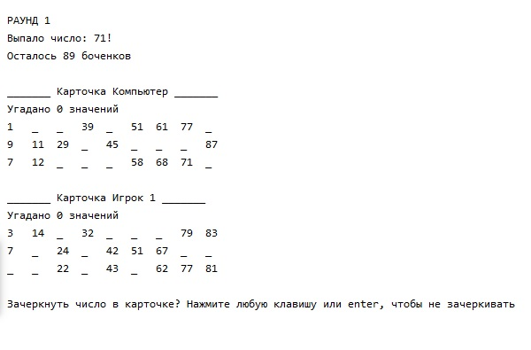
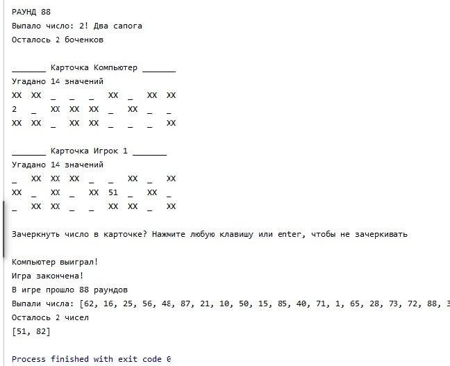

Lotto console game
==============

Number of players: 2, computer and you

Number of barrels: from 1 to 90

Cards per Player: 1 unit

Play card has an individual grid of 27 squares made up of 3 rows and 9 columns.
Each row contains 5 numbers and 4 blank squares. 15 numbers appear on every card.

Dealer is the person that reads out the randomly chosen barrels that determine which squares get covered on everyone
's play cards. 

Each player covers squares and needs to cover all 15 numbers in card to win. 

To cover the number represented by chosen barrel player should confirm that there is number in play card via input. 

If player is mistaken, the game overs and computer wins. 

